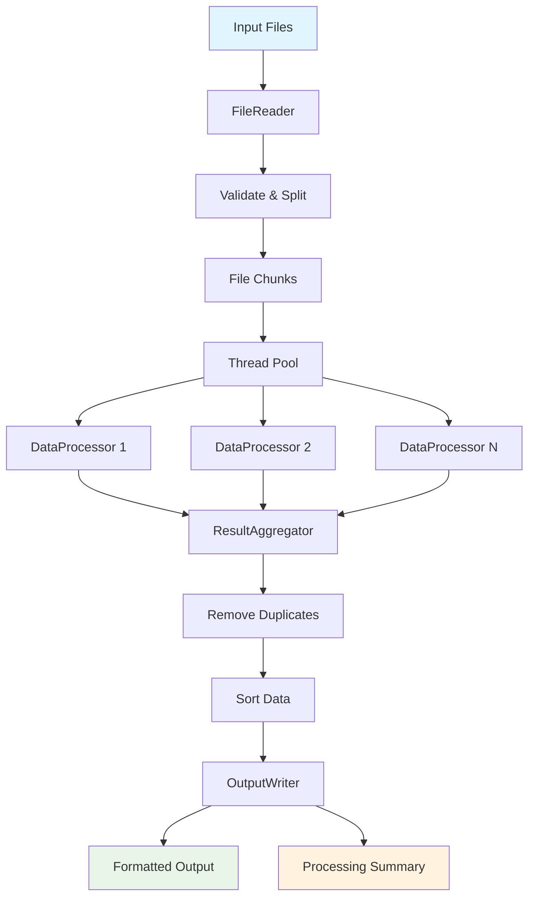

# Multi-threaded File Processor

## Table of Contents
- [Introduction](#introduction)
- [Professional, Educative & Learning Standpoint](#professional-educative--learning-standpoint)
- [Aim and Objective](#aim-and-objective)
- [Project Goals](#project-goals)
- [System Overview](#system-overview)
- [User Expectations](#user-expectations)
- [System Components](#system-components)
- [Component Interactions](#component-interactions)
- [Workflow](#workflow)
- [Project Structure](#project-structure)
- [Installation & Usage](#installation--usage)

## Introduction

A **Multi-threaded File Processor** is a high-performance software system designed to process large files efficiently by leveraging parallel computing. Traditional file processing reads and processes files sequentially, which can be slow for large datasets. This system breaks files into smaller chunks and processes them concurrently across multiple threads, significantly improving throughput and performance while maintaining data integrity through proper synchronization mechanisms.

## Professional, Educative & Learning Standpoint

### Professional Perspective
- **Enterprise-Grade Architecture**: Production-ready system with proper error handling and resource management
- **Performance Optimization**: Demonstrates real-world parallel processing patterns used in big data applications
- **Scalability**: Designed to handle variable workloads and file sizes efficiently
- **Best Practices**: Implements industry standards for concurrent programming and file I/O operations

### Educational Value
- **Concurrency Fundamentals**: Teaches thread management, synchronization, and race condition prevention
- **Design Patterns**: Illustrates Producer-Consumer, Pipeline, and Executor patterns
- **Java SE Mastery**: Comprehensive usage of Java's concurrency utilities and collections
- **System Architecture**: Modular design with clear separation of concerns

### Learning Objectives
- Understand multi-threading concepts and thread safety
- Master Java's Executor Framework and Future patterns
- Learn file I/O operations in concurrent environments
- Practice exception handling and resource management
- Implement proper synchronization mechanisms

## Aim and Objective

### Primary Aim
Develop a high-performance file processing system that leverages multi-threading to process large files efficiently while maintaining data integrity through proper synchronization.

### Key Objectives
1. **Performance**: Process multiple file chunks concurrently to maximize throughput
2. **Reliability**: Ensure data consistency and prevent corruption across threads
3. **Scalability**: Handle variable file sizes and processing loads efficiently
4. **Maintainability**: Create clean, modular architecture with clear separation of concerns
5. **Monitoring**: Provide comprehensive processing metrics and progress tracking

## Project Goals

- **Throughput**: Maximize processing speed through intelligent parallelization
- **Data Integrity**: Prevent race conditions and ensure consistent results
- **Resource Management**: Efficient thread and memory utilization
- **Error Resilience**: Graceful handling of file errors and processing failures
- **Monitoring**: Real-time progress tracking and performance metrics
- **Configurability**: Flexible setup for different use cases and environments

## System Overview

The Multi-threaded File Processor follows a structured pipeline approach:

```
Input Files -> File Reading -> Chunk Splitting -> Parallel Processing 
    -> Result Aggregation -> Output Generation -> Final Results
```

### Key Characteristics:
- **Modular Design**: Each component has a single responsibility
- **Thread-Safe Operations**: Proper synchronization throughout the pipeline
- **Configurable Parallelism**: Adjustable thread pool and chunk sizes
- **Progress Monitoring**: Real-time statistics and progress updates
- **Error Handling**: Comprehensive exception management

## User Expectations

### Input Requirements
- Multiple files of various formats (TXT, CSV, JSON)
- Configurable chunk sizes for processing
- Custom data transformation rules
- Flexible input/output directory configuration

### Output Deliverables
- Consolidated processed results in specified format
- Summary reports with detailed processing metrics
- Error logs for failed operations
- Formatted output files with configurable sorting

### System Qualities
- **Performance**: Fast processing completion times
- **Reliability**: No data corruption or loss
- **Visibility**: Real-time progress monitoring
- **Flexibility**: Configurable parallelism levels
- **Robustness**: Graceful error handling and recovery

## System Components

### 1. FileReader
**Responsibilities:**
- Read input files from specified directory
- Validate file formats and accessibility
- Split files into manageable chunks
- Create processing tasks for each chunk

**Key Methods:**
- `readFiles()` - Scan and validate input directory
- `splitIntoTasks()` - Divide files into processing chunks
- `validateFormat()` - Verify file structure and format

### 2. DataProcessor
**Responsibilities:**
- Process individual data chunks in parallel threads
- Apply transformation logic to each data element
- Validate processing results
- Handle chunk-level errors gracefully

**Key Methods:**
- `processChunk()` - Transform chunk data
- `transformData()` - Apply data transformations
- `validateResults()` - Verify processing output

### 3. ResultAggregator
**Responsibilities:**
- Merge results from multiple processing threads
- Remove duplicate entries based on configurable strategies
- Sort final dataset according to specified criteria
- Maintain data consistency during aggregation

**Key Methods:**
- `mergeResults()` - Combine partial results
- `removeDuplicates()` - Eliminate redundant data
- `sortData()` - Order final results

### 4. OutputWriter
**Responsibilities:**
- Write consolidated results to output files
- Format output according to specifications
- Generate processing summaries and reports
- Manage output directory structure

**Key Methods:**
- `writeToFile()` - Save processed data
- `formatOutput()` - Structure output format
- `generateSummary()` - Create processing reports

### 5. Configuration & Management
**Supporting Components:**
- `ProcessorConfig` - System configuration parameters
- `ThreadPoolManager` - Thread pool management
- `ProcessingPipeline` - Main workflow coordination

## Component Interactions

The system components interact through a well-defined pipeline:

```
FileReader 
    | (produces chunks)
ThreadPool Manager 
    | (distributes to threads)
DataProcessor (multiple instances)
    | (produces partial results)
ResultAggregator
    | (produces final dataset)
OutputWriter
    | (generates output files)
File System
```

### Interaction Details:
- **FileReader -> ThreadPool**: Chunks are submitted as callable tasks
- **ThreadPool -> DataProcessor**: Tasks are executed in parallel threads
- **DataProcessor -> Aggregator**: Processed results are collected thread-safely
- **Aggregator -> OutputWriter**: Final results are passed for output generation

## Workflow



### Workflow Steps:
1. **File Discovery**: Scan input directory for valid files
2. **Chunk Creation**: Split files into configurable-sized chunks
3. **Parallel Processing**: Process chunks concurrently using thread pool
4. **Result Collection**: Aggregate processed results thread-safely
5. **Data Refinement**: Remove duplicates and sort final dataset
6. **Output Generation**: Write results and generate summary reports

## Project Structure

```
multi-threaded-file-processor/
|-- src/
|   |-- com/
|   |   |-- fileprocessor/
|   |   |   |-- Main.java
|   |   |   |-- config/
|   |   |   |   |-- ProcessorConfig.java
|   |   |   |   |-- ThreadConfig.java
|   |   |   |-- filereader/
|   |   |   |   |-- FileReader.java
|   |   |   |   |-- FileValidator.java
|   |   |   |   |-- Chunk.java
|   |   |   |-- dataprocessor/
|   |   |   |   |-- DataProcessor.java
|   |   |   |   |-- Transformation.java
|   |   |   |   |-- ProcessorTask.java
|   |   |   |-- aggregator/
|   |   |   |   |-- ResultAggregator.java
|   |   |   |   |-- DuplicateRemover.java
|   |   |   |   |-- DataSorter.java
|   |   |   |-- writer/
|   |   |   |   |-- OutputWriter.java
|   |   |   |   |-- SummaryGenerator.java
|   |   |   |   |-- OutputFormatter.java
|   |   |   |-- model/
|   |   |   |   |-- ProcessingResult.java
|   |   |   |   |-- ProcessingStats.java
|   |   |   |   |-- ProcessedData.java
|   |   |   |-- exception/
|   |   |   |   |-- FileProcessingException.java
|   |   |   |   |-- ChunkProcessingException.java
|   |   |   |-- manager/
|   |   |   |   |-- ThreadPoolManager.java
|   |   |   |   |-- ProcessingPipeline.java
|-- input/                          # Input directory for source files
|-- output/                         # Output directory for processed results
|-- bin/                            # Compiled class files
|-- build.sh                        # Build script
|-- README.md                       # This file
```

## Installation & Usage

### Prerequisites
- Java 8 or higher
- Basic understanding of command line operations

### Quick Start
1. **Clone and Setup**:
   ```bash
   git clone <repository-url>
   cd multi-threaded-file-processor
   mkdir -p input output
   ```

2. **Add Input Files**:
   ```bash
   # Add your files to the input/ directory
   cp your-data.txt input/
   ```

3. **Build and Run**:
   ```bash
   ./build.sh
   java -cp bin com.fileprocessor.Main input/ output/ 4 1000
   ```

### Configuration Options
- **Thread Pool Size**: Number of concurrent processing threads
- **Chunk Size**: Number of lines per processing chunk
- **Input/Output Directories**: Source and destination paths
- **Duplicate Removal**: Enable/disable duplicate elimination
- **Sorting**: Enable/disable output sorting

### Example Usage
```bash
# Process with 8 threads, 500 lines per chunk
java -cp bin com.fileprocessor.Main /data/input/ /data/output/ 8 500

# Process with default settings
java -cp bin com.fileprocessor.Main
```

This system demonstrates professional-grade concurrent file processing with educational clarity, making it an excellent resource for learning advanced Java programming concepts while providing practical utility for data processing tasks.
